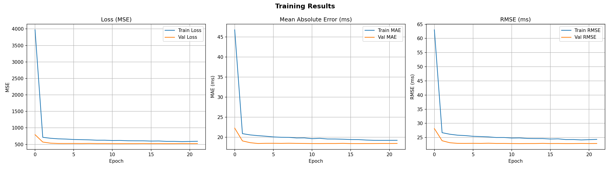
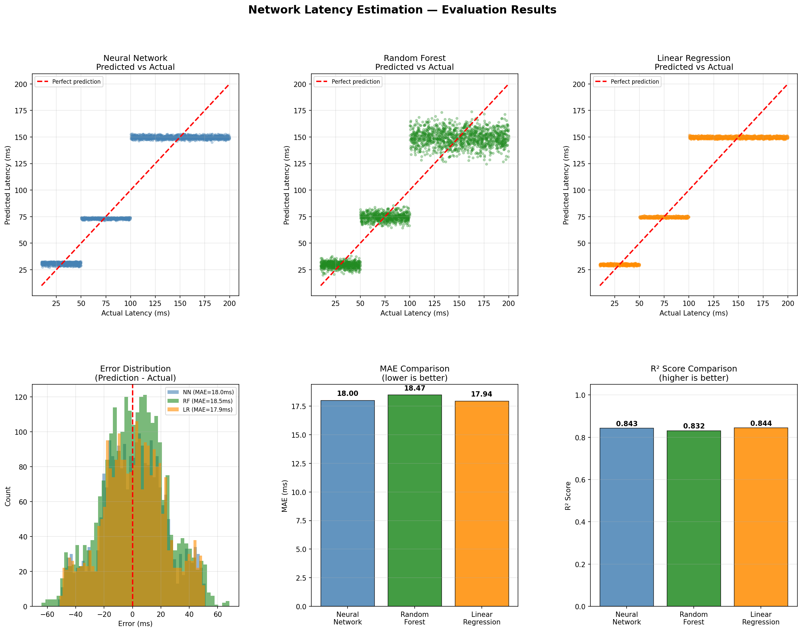

# Network Latency Estimation in Cellular Networks

A deep learning system that predicts network latency (ms) based on 
real cellular network measurements using TensorFlow.

## Project Overview
- **Dataset**: 16,829 real-world signal measurements
- **Network Types**: 3G, 4G, 5G, LTE
- **Target**: Predict latency (10ms → 200ms)
- **Model**: Feedforward Neural Network (12,673 parameters)

## Results

| Model            | MAE (ms) | RMSE (ms) | R² Score |
|------------------|----------|-----------|----------|
| Neural Network   | 18.00    | 22.30     | 0.843    |
| Linear Regression| 17.94    | 22.22     | 0.844    |
| Random Forest    | 18.47    | 23.10     | 0.832    |


## Visualizations




## Project Structure
```
tf_project/
├── data/                  # Processed data files
├── plots/                 # Training and evaluation charts
├── explore_data.py        # Step 1 - Data exploration
├── prepare_data.py        # Step 2 - Preprocessing
├── model.py               # Step 3 - Neural network architecture
├── train.py               # Step 4 - Model training
├── evaluate.py            # Step 5 - Evaluation vs baselines
├── predict.py             # Step 6 - Predict new inputs
└── requirements.txt       # Library dependencies
```

## How to Run

### 1. Install dependencies
```bash
pip install -r requirements.txt
```

### 2. Run the pipeline in order
```bash
python prepare_data.py
python train.py
python evaluate.py
python predict.py
```

## Tech Stack
- Python 3.x
- TensorFlow / Keras
- Scikit-learn
- Pandas, NumPy
- Matplotlib
```

## Dataset
:bar_chart: **Source:** [Kaggle - Cellular Network Analysis Dataset](https://www.kaggle.com/datasets/suraj520/cellular-network-analysis-dataset/)